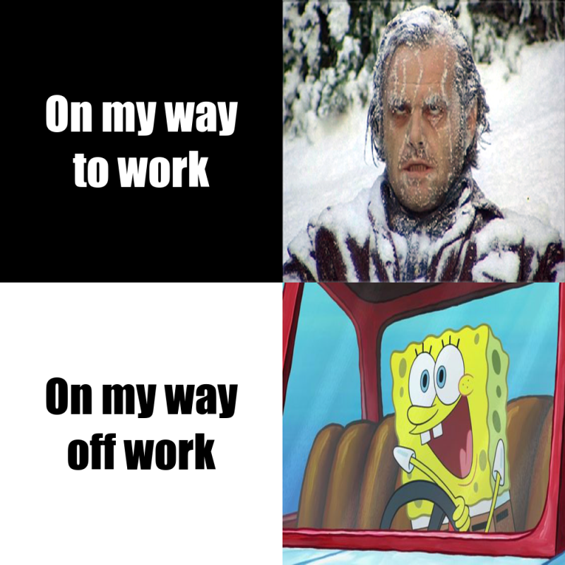

# 你好! 欢迎来得到我的STATS 220 主页
# Hello! Welcome to my STATS 220 Github

## Introduce to my meme
* This is a meme I made by R with the R package [{magick}](https://cran.r-project.org/web/packages/magick/vignettes/intro.html).  
* I use this meme to express my mood changes when I commute. *It's actually a joke, I love my job*. 😝 
* I just stumbled across a picture of [Jack freezing in the car](https://i.stack.imgur.com/FxJvk.jpg) and [SpongeBob driving happily](https://i.pinimg.com/564x/fb/56/8b/fb568b7b5f90042304051c311233abe2.jpg). And I thought these two pictures were hilarious. 
This mood change makes me feel good to make it as a meme. 



## Method used to make the meme
Here's my code to make the meme. Feel free to leave your comments about it, it will make me **super**, lol.


```{r}
library(magick)


# first meme
go_to_work <- image_read("https://i.stack.imgur.com/FxJvk.jpg") %>% 
  image_resize("500x500!")

# second meme
off_work <- image_read("https://i.pinimg.com/564x/fb/56/8b/fb568b7b5f90042304051c311233abe2.jpg") %>% 
  image_resize("500x500!")

# first text
             # the box
work_text <- image_blank(width = 500, height = 500, # size
                       color = "#000000") %>%  # filling color
  # the text
  image_annotate(text = "On my way\nto work", # text content
                 color = "#FFFFFF", # text color
                 size = 80, # text size
                 font = "Impact", # text font
                 gravity = "center") # text loction

# second text
off_text <- image_blank(width = 500, 
                        height = 500, 
                        color = "#FFFFFF") %>% 
  image_annotate(text = "On my way\noff work", 
                 color = "#000000", 
                 size = 80, 
                 font = "Impact", 
                 gravity = "center")

# append the first meme and text together
top_row <- image_append(c(work_text, go_to_work))

# append the second meme and text together
bottom_row <- image_append(c(off_text, off_work))

# the whole meme
work_meme <- c(top_row, bottom_row) %>% 
  image_append(stack = TRUE) %>% 
  image_scale(800)

work_meme
```
